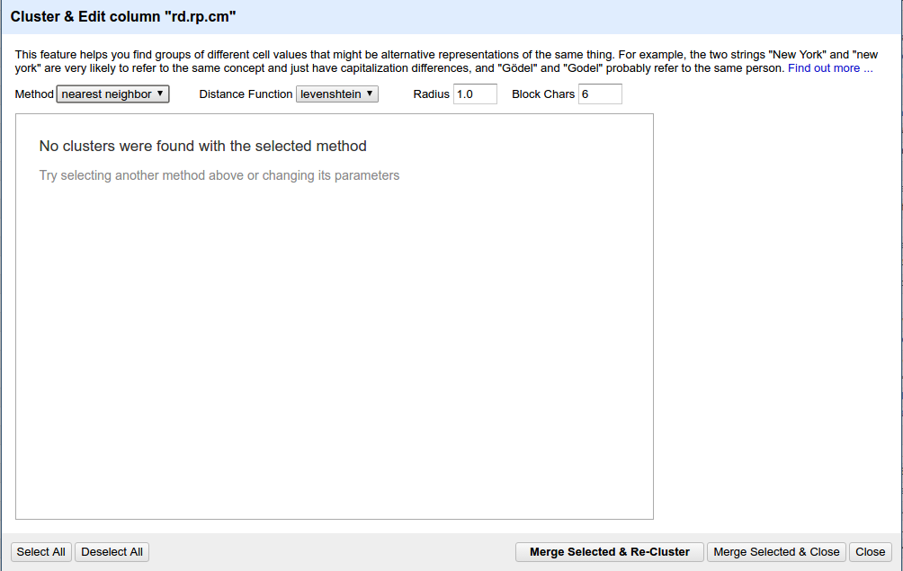

```{r}
library(ggplot2)
library(dplyr)
library(ggmap)
library(rmarkdown)
library(knitr)
```
#Reading data from csv file
```{r}
data.all <- read.csv(file="all-semi-unique.csv",head=TRUE,sep=",")
summary(data.all)
```

Check dimensions of the data
```{r}
dim(data.all)
```

Check columns with one unique value
```{r}
unique.cols.cnt = sapply(data.all, function(x) length(unique(x)))
unique.cols.cnt
```

From the data, it is clear that all the advertisement columns in addition to the "rd.rp.type" and "rd.cl" have only one value and hence can be neglected.
```{r}
data.multivalue.cols <- data.all[, !names(data.all) %in% names(unique.cols.cnt[unique.cols.cnt==1])]
dim(data.multivalue.cols)
```

Before dealing with the NA values and duplicated rows, the semantic meaning of the columns' names has to be investigated first. After observing the html files of the crawled website, the potential meanings of the columns' names can be summarized in the following table:
```{r}
lbl<-c(1,2,3,4,5,6,7,8,9,10)
mng<-c("halawa","laziz","mashy","zahma","mafish amal","Question","Radar/Lagna","Aaccident","Construction","Automatic report")
tbl<-cbind(lbl,mng)
tbl%>%kable()
```

Let's remove the duplicate rows accorrding to the rd.rp.cmid
```{r}
data.noduplicatedrows <- data.multivalue.cols[!duplicated(data.multivalue.cols$rd.rp.cmid),]
dim(data.noduplicatedrows)
```
The number of rows is reduced drastically
Now that all the columns have 2 or more unique values, let's have a look on the NA's
```{r}
nas.cnt = sapply(data.noduplicatedrows, function(x) sum(is.na(x)))
nas.cnt
```
Before excluding the rd.rp.fullnm because it adds no information especially that the username is given by the rd.rp.nm column, let's check on the percentage of users who choose a full name:
```{r}
users.total <- length(unique(data.noduplicatedrows$rd.rp.nm))
cat("Total number of unique users: ",users.total)
cat("Percentage of users with a full name:", length(unique(data.noduplicatedrows$rd.rp.fullnm))/users.total)
```
Same applies for the number of people who have a profile picture which is saved in the column rd.rp.img. Let's see the percentage of users not having a profile picture:
```{r}
cat("Percentage of users with a profile picture: ",length(unique(data.noduplicatedrows$rd.rp.img))/users.total)
```
Let's remove the rd.rp.fullnm and rd.rp.img columns
```{r}
data.rm.nas <- data.noduplicatedrows[ , !(names(data.noduplicatedrows) %in% c("rd.rp.fullnm","rd.rp.img"))]
dim(data.rm.nas)
nas.cnt = sapply(data.rm.nas, function(x) sum(is.na(x)))
nas.cnt
```
Now let's examine the rd.rp.rpImg column which indicates that teh report has an image attached to it.
```{r}
nas.cnt["rd.rp.rpImg"]/nrow(data.noduplicatedrows)
```
Hence, the percentage of people not attaching a photo to the report is great. Let's examine the common staus of roads when people usually attach an image
```{r}
attached.images <- data.rm.nas %>% filter(!is.na(rd.rp.rpImg)) %>% select(rd.rp.stid) %>% group_by(rd.rp.stid) %>% summarise(n=n()) %>% arrange(desc(n))
temp <- (data.rm.nas %>% filter(!is.na(rd.rp.rpImg)) %>% select(rd.rp.stid) %>% filter(!is.na(rd.rp.stid)))
attached.images
ggplot() + geom_histogram(data = temp, aes(x=rd.rp.stid,y = (..count..)/sum(..count..)))+scale_x_continuous(name="Road Status")+scale_y_continuous(name="Percentage of attached pictures")
```

From the plot it is clear that people tend to post pictures indicating empty roads rather than blocked roads.

No let's keep dealing with the NA values of the data. The three columns rd.stid, rd.hr and rd.mn do not add any extra information about the roads and are considered redundant since they are aggregation of data of reports. So they are removed along with rd.rp.rpImg after extracting meaningful information from it in previous steps

also removed rd.img column temporarly because its meaning is not clear so far and contains many NAs.
```{r}
data.rm.nas2 <- data.rm.nas[ , !(names(data.rm.nas) %in% c("rd.stid", "rd.hr" , "rd.mn","rd.rp.rpImg","rd.img"))]
dim(data.rm.nas2)
nas.cnt = sapply(data.rm.nas2, function(x) sum(is.na(x)))
nas.cnt
```
Ultimately, only one column rd.rp.stid still contains NAs, let's have a look on some of the rows with NA value in that column:
```{r}
data.na.stid <- data.rm.nas2 %>% filter(is.na(rd.rp.stid))
data.valid.stid <- data.rm.nas2 %>% filter(!is.na(rd.rp.stid))
temp<-data.na.stid
dim(temp)
temp[sample(nrow(temp), 10), ] %>% kable()
```

In order take the temp data frame to open refine, it needs to be exported as a csv file:
```{r}
write.csv(file="test.csv",x=temp)
```

For some reason, open refine does not compute the clusters as shown in the screenshot:

This is why we needed to impute the missing NAs through some other way. The following commands were tested:
```{r, eval=F}
library("DMwR")
clean.data <- knnImputation(data.rm.nas2)

library("VIM")
clean.data <- irmi(data.rm.nas2)
```
The first approach tries to find similar rows as each of the ones containing a NA value in the rd.rp.stid column. However through manual inspection, it was clear that the assigned values for rd.rp.stid were mis-leading since the algorithm uses Gower's algorithm as the distance metric which performs poorly with string such as the ons n the rd.rp.cm column.

The other approach tries to build a predictive regression model and predict the missing values for the rd.rp.stid column, however it performed also poorly after manual inspection.

Thus, another approach had to be implemented in order to check the Levenshtein Distance between the comments of the reports, just as open refine would have done it. This was achieved through the following function calls:
Remember that the data is divided on the two data frames data.na.stid and data.valid.stid where the first contains all the rows with NAs in the stid column and the latter contains the rest:
```{r,eval=F}
cm.indecies <- amatch(data.na.stid$rd.rp.cm, data.valid.stid$rd.rp.cm, nomatch = NA_integer_, matchNA = TRUE, method = "lv",
       useBytes = FALSE, weight = c(d = 1, i = 1, s = 1, t = 1), maxDist = 100,
       q = 1, p = 0, nthread = getOption("sd_num_thread"))
```

```{r}
cm.indecies <- read.csv(file="indecies.csv",head=TRUE,sep=",")
cmp.cm <- data.na.stid
cmp.cm <- cmp.cm %>% mutate(Index=cm.indecies[,2])
cmp.cm <- cmp.cm %>% mutate(cmp.rp.cm=data.valid.stid$rd.rp.cm[Index])
cmp.cm <- cmp.cm %>% mutate(cmp.rp.stid=data.valid.stid$rd.rp.stid[Index])
cmp.cm$rd.rp.stid <- cmp.cm$cmp.rp.stid

cmp.cm %>% select("Actual comment"=rd.rp.cm,"Matched comment"=cmp.rp.cm,"Imputed stid"=rd.rp.stid) %>% head(n=20) %>% kable()
```

The code above looks for the minimum Levenshtein Distance for each comment in data.na.stid in the set of comments from data.valid.stid and assigns it to the respective rd.rp.stid.
Let's combine the all the rows together:
```{r}
data.semi.ready <- rbind(cmp.cm[,!(names(cmp.cm) %in% c("Index", "cmp.rp.cm" , "cmp.rp.stid"))] %>% filter(!is.na(cmp.cm$rd.rp.stid)),data.valid.stid)
summary(data.semi.ready)
```
The actual date of the reports is computed from the columns crawl_data, rd.rp.nm and rd.rp.hr
```{r}
data.test <- data.semi.ready
data.test$crawl_date <- as.POSIXct(data.test$crawl_date,format = "%a %b  %d %H:%M:%S",tz = "UTC")
data.semi.ready <- data.semi.ready %>% mutate(report.time= data.test$crawl_date -(data.test$rd.rp.hr * 60 * 60) - (data.test$rd.rp.mn * 60))
data.semi.ready <- data.semi.ready %>% mutate(report.time.hrs= format(report.time, format="%y-%m-%d %H"))
data.semi.ready <- data.semi.ready %>% mutate(report.time.day= format(report.time, format="%y-%m-%d"))
data.semi.ready <- data.semi.ready %>% mutate(report.time.hour= format(report.time, format="%H"))
data.semi.ready <- data.semi.ready %>% mutate(report.time.hrs.round= format(round(report.time, units="hours"), format="%y-%m-%d %H"))
```
Divide the name to a location and a direction
```{r}
temp.split<-data.frame(strsplit(as.character(data.semi.ready$rd.nm), "[;]"))
temp.split.t<-t(temp.split)
data.semi.ready<-data.semi.ready%>%mutate(location=temp.split.t[,1],direction=temp.split.t[,2])
data.semi.ready[sample(nrow(t), 10), ]
```
Do the same to get from and to
```{r}
temp.split <- t(data.frame(strsplit(as.character(data.semi.ready$direction), " To ")))
data.semi.ready<-data.semi.ready%>%mutate(from=temp.split[,1],to=temp.split[,2])
data.semi.ready[sample(nrow(t), 10), ]
```
Now let's divide the data into 2 categories: the first one is direct user reports having an stid from 1-5 and the other gropu is informative reports having stid from 6-10:
```{r}
data.rpts <- data.semi.ready%>%filter(rd.rp.stid %in% c(1,2,3,4,5))
data.info <- data.semi.ready%>%filter(rd.rp.stid %in% c(6,7,8,9,10))
```

Examining the road with the highest reported accidents. The examination will proceed with eliminating the repeated reports of any accident, assuming that any accient is not reported twice within one hour, then accumilating the number of accidents for one road.

```{r}
temp.accidents <- data.info %>% filter(rd.rp.stid==8)
nrow(temp.accidents)
temp.accidents <- temp.accidents[!duplicated(temp.accidents$report.time.hrs,temp.accidents$rd.nm),]
data.accidents <- temp.accidents%>%group_by(location)%>%summarise(n=n())%>%arrange(desc(n))
nrow(data.accidents)
data.accidents %>% kable()
ggplot(data = temp.accidents, aes(x=location)) + geom_bar()+labs(title="Accidents")+ geom_bar()+ theme(axis.text.x = element_text(angle = 90, hjust = 1))
```

Examining the number of reports with respect to the road for radars and checkpoints

```{r}
temp.radars <- data.info %>% filter(rd.rp.stid==7)
nrow(temp.radars)
temp.temp <- temp.radars[!duplicated(temp.radars$report.time.hrs,temp.accidents$rd.nm),]
data.radars <- temp.radars%>%group_by(location)%>%summarise(n=n())%>%arrange(desc(n))
nrow(data.radars)
data.radars %>% kable()
ggplot(data = temp.radars, aes(x=location)) + geom_bar()+labs(title="Radars/Checkpoints")+ geom_bar()+ theme(axis.text.x = element_text(angle = 90, hjust = 1))
```

Now let's examine the users' activities with respect to the time of the day
```{r}
ggplot(data = data.semi.ready, aes(report.time.hour)) + geom_bar()+facet_wrap(~ rd.rp.stid)+labs(title="Number of reports")+ geom_bar()+ theme(axis.text.x = element_text(angle = 90, hjust = 1))
```

The cummilative plot of the plots above is the following
```{r}
ggplot(data = data.semi.ready, aes(x=report.time.hour)) + geom_bar()+labs(title="Number of reports")+ theme(axis.text.x = element_text(angle = 90, hjust = 1))
```
Notice the two peeks which indicate the peeks reporting.

In order to examine the top reporters on the website, we consider the following table:
```{r}
data.reporters <- data.semi.ready%>%group_by(rd.rp.nm)%>%summarise(n=n())%>%arrange(desc(n))
nrow(data.reporters)
data.reporters %>%head(n=10)%>% kable()
```


To examine the freqency of reports of single user in one hour, consider the following table
```{r}
data.reporters <- data.semi.ready%>%group_by(rd.rp.nm,report.time.hrs)%>%summarise(n=n())%>%arrange(desc(n))
nrow(data.reporters)
data.reporters %>%head(n=10)%>% kable()
```

The table shows weird behavior for user "007", because 29 reports in a single hour is not a logical number. Hence let's examine those rows carefully:
```{r}
data.semi.ready %>% filter(rd.rp.nm=="007",report.time.hrs=="16-02-15 05")%>%arrange(desc(report.time))%>%select(report.time,rd.nm,rd.rp.cm)%>%kable()
```

From the table we can clearly see that this data is not correct and should not be considered for future computations.

In order to monitor the average traffic over the day for a sample roads consider the following two plots:
```{r}
firstPlot <- function(x){
ggplot(data.semi.ready%>%filter(rd.nm==x,rd.rp.stid %in% c(1,2,3,4,5)), aes(x=report.time.hour, y=rd.rp.stid, fill=rd.rp.stid)) + geom_boxplot()+labs(title=x)
  
}

secondPlot <- function(x){
  t1 <- data.semi.ready%>%filter(rd.nm==x,rd.rp.stid %in% c(1,2,3,4,5))%>%group_by(report.time.hour)%>%summarise(avg=mean(rd.rp.stid),med=median(rd.rp.stid))

ggplot(data = t1, aes(x=report.time.hour,y=avg,group = 1)) + stat_smooth()+labs(title=x)
}

firstPlot("Kobry 6 October;Mohandesin To Ta7rir")
secondPlot("Kobry 6 October;Mohandesin To Ta7rir")

firstPlot("Batal Ahmed St.;Gam3et Dowal To Orman")
secondPlot("Batal Ahmed St.;Gam3et Dowal To Orman")

firstPlot("Faissal St.;Remaya Sq. To Giza Sq.")
secondPlot("Faissal St.;Remaya Sq. To Giza Sq.")
```